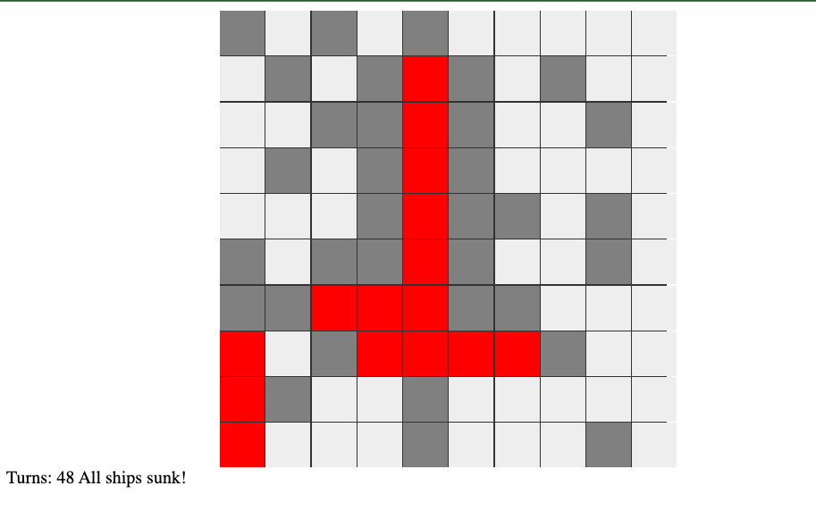

# Battleship Game

This is a simple 10x10 grid battleship game implemented using HTML, CSS, and JavaScript. The game features ships of varying sizes (5, 4, 3, and 3) placed randomly on the grid. Players can click on cells to attack and attempt to sink all the ships. The number of turns taken is displayed on the page.

## Code Explanation

The code is split into four files:

### index.html

This file contains the basic structure of the HTML page. It has a div element with an id `game-board` to hold the game board and another div with an id `turns` to display the turns count. The CSS and JavaScript files are also linked in the head and at the end of the body.

### styles.css

This file has the styling for the game board and cells. The game board is set to use CSS Grid with 10 columns, and the cells have a fixed width and height. The background colors and grid gap are also defined here.

### class.js

This file contains the classes `Cell` and `Map`. The `Cell` class has properties such as `x`, `y`, `hasShip`, and `hit`, along with a method `attack()` to handle attacks on cells. The `Map` class has properties `size` and `cells`, along with methods to generate cells, place ships, and attack cells.

### main.js

This file handles the main game logic, such as creating the map, placing ships, and rendering the game board.

- `gameBoard` and `turnsElement` are references to the HTML elements for the game board and the turns count display.
- `map` is an instance of the `Map` class with a size of 10.
- `placeRandomShips()` is a function that takes an array of ship objects and places them on the game board. It ensures that ships do not overlap by checking whether a ship can be placed in a certain position using the `canPlaceShip()` function.
- `canPlaceShip()` checks if a ship can be placed at a specific position without going out of bounds or overlapping with other ships.
- `turns`, `shipsSunk`, and `totalShipSize` are variables to keep track of the number of turns taken, the number of ships sunk, and the total size of all ships, respectively.
- `renderMap()` is a function that renders the game board by creating cell elements for each cell in the map and adding event listeners for click events. It also updates the turns count displayed on the page and checks if all ships have been sunk.

The game sets up a 10x10 grid battleship game with ships of varying sizes (5, 4, 3, and 3). The game board is rendered, and ships are placed randomly on the grid. The number of turns taken to sink all the ships
